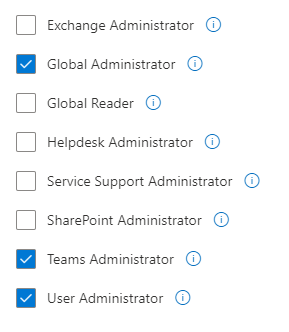

<h2><u> Step I: Install Teams Toolkit Extension</u></h2>

1. Open [VS Code](https://code.visualstudio.com/)
2. Go to Extension tabs or press Ctrl+Shift+X
3. In the search bar, search Teams Toolkit > Install Microsoft Team Toolkit.


<h2><u> Step II: Account Setup</u></h2>

After successfully installing the extension
1. Go to Accounts tab > Login or create a new [M365 tenant account](https://developer.microsoft.com/en-us/microsoft-365/dev-program) using your outlook account.

2. Login or create a new [azure account](https://azure.microsoft.com/en-us/get-started/azure-portal/).
    We need azure account for provisioning, deploying and managing our bot service
    

<h2><u> Step III: Teams Bot Creation</u></h2>

After successfully logging, it's team to create pur bot service

1. Go to Teams Toolkit extension, Under *Development* tab > Click *Create new Teams App*
2. Select *Create new Teams App* or you can select Start from a sample to play around with different bots
3. Select capability as *Bot*
    
4. Select language as *Javascript* 
5. Select a folder and Enter your *application name*

Voila!!, We have successfully created our bot.

Now we will see how to add functions to the bot.

<h2><u> Step III: Teams Bot Configuration</u></h2>

1. After creating the bot, the file structure will look like this.

2. Execute the following command
```sh
git clone https://github.com/Ekatra-MS-Teams-Bot
cd Ekatra-MS-Teams-Bot
```
3. Replace the existing bot folder with the cloned or downloaded bot folder.
4. Rename .env_example to .env_ and add your airtable API keys

<h2><u> Step IV: Teams Bot Deployment</u></h2>

After adding functions to your bot, it's time to deploy to our azure account.

1. Go to Teams Toolkit extension, Under Deployment tab > Under *Deployment* tab > Click Provision > Sign In into azure account if you haven't already > Ok

2. Enter your *resource group* name
    
3. Click Ok.

    Wait for the provisioning to complete. ⏳
    Meanwhile you can learn about Provisioning [here](https://docs.microsoft.com/en-us/microsoftteams/platform/toolkit/provision?from=teamstoolkit)
4. After successfully provisioning the resources, Click on *Deploy to the cloud*

    While waiting for the deployment to complete, Go to [Deploy Teams app to the cloud](https://docs.microsoft.com/en-us/microsoftteams/platform/toolkit/deploy?from=teamstoolkit) to learn more about the deployment process.
<h2><u> Step V: Azure Configuration</u></h2>

After successfully deploying.
1. Login to [Azure Portal](https://azure.microsoft.com/en-us/get-started/azure-portal/)
2. You will a resource group created by the given name, under the resource group we have
    
    i. Azure Bot
    
    ii. Managed Identity

    iii. App Service plan

    iv. App Service

2. Click on Azure bot > Go to Settings > Configuration > Under *Messaging Endpoint* > Check *Enable Streaming Endpoint*

    

3. Go to *Channels* > From the available channels select *Microsoft Teams* and add it to the bot.
    

<h2><u> Step VI: Debugging</u></h2>

1. Under your resource group > *Click  App Service* > From the left menu, scroll down to *Monitoring* and click *App Service Logs*

2. Turn on App Service > Application logging (Blob), Application logging (Filesystem) > Click *Save*

3. Now go to *Log Stream* > Click *Reconnect*

Here you can see your console logs.

<h2><u> Step VII: Publishing the bot</u></h2>

1. Go to Teams Toolkit extension, Under Deployment tab > Under *Deployment* tab > Click *Publish*

2. Select *Install for your organization*
3. Now login to [Microsoft 365 admin center](https://admin.microsoft.com/) with your M365 account
4. Click on *Active Users*
5. From list of active users, click on your email address and check if you have **Team Administrator** privileges if not, you will have to create a new alternative account to escalate the role

    i. Click Add user > Fill out the necessary information but make sure while assigning roles you check at least **Team Administrator**, **User Administrator** and **Global Administrator** roles   
    

    ii. After successfully creating an alternate email, login to admin center with this email and password > Go to *Active Users* > Click on your *primary email address* > Click *Manage Roles* > Assign yourself at least **Team Administrator**, **User Administrator** and **Global Administrator** roles .

6. Log in to [Microsoft Teams admin center](https://admin.teams.microsoft.com/) with your primary M365 account.

7. Go to *Teams App* > *Manage Apps* > Yoi will see pending approval as 1

8. Search your bot by your bot's name >Now click *Approve*.

    If you followed all the steps, you will see the output like this:

    


<h2><u> Step VIII: Distributing the bot</u></h2>

1. login to [Microsoft 365 admin center](https://admin.microsoft.com/) with your M365 account
2. Go to Users > Under Active users > Click *Add users* to add users to your organization.
3. Save these emails and passwords and share it with the individual users respectively.
4. The new user has to login to [Teams Web App](https://teams.microsoft.com/) for the first time to reset their password

After successfully logging in with the given email and new password, the user can install the app by 

1. Going to *Apps* tab > Under Built for your orgs, If everything went well, The approved teams app will be available


2. Click add. 

### Phew!,That was a long process, but we have successfully created our Microsoft Teams App.🎉


